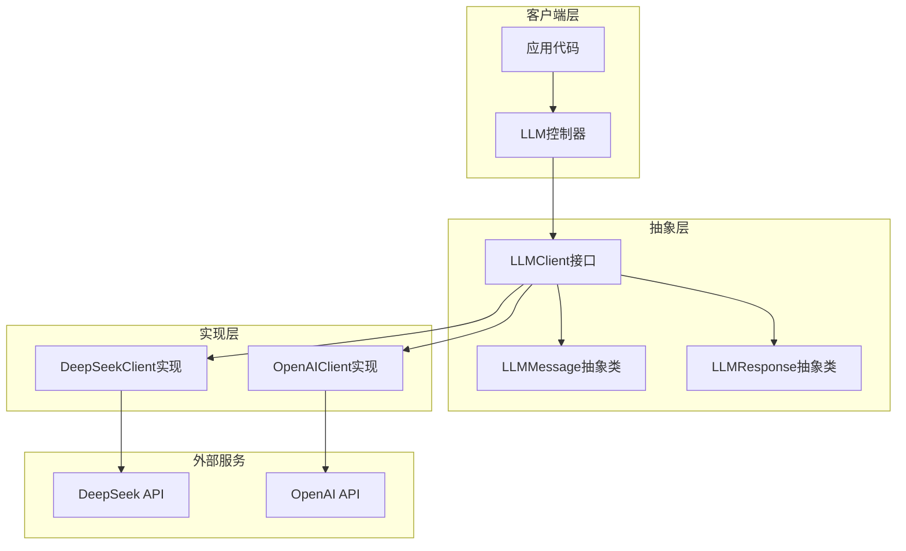

# 统一LLM抽象层设计文档

## 1. 设计背景

随着大语言模型（LLM）技术的快速发展，不同模型提供商（如DeepSeek、OpenAI等）的API接口和使用方式存在差异，导致项目在集成多个LLM时需要编写大量重复代码，维护成本较高。为了解决这一问题，设计一个统一的LLM抽象层，屏蔽不同模型提供商的实现差异，提供一致的API接口，使项目能够灵活切换不同的LLM提供商。

## 2. 设计目标

- **统一性**：提供统一的API接口，屏蔽不同LLM提供商的实现差异
- **可扩展性**：支持轻松添加新的LLM提供商实现
- **兼容性**：保持与现有代码的向后兼容性
- **功能完整性**：支持多轮对话、简单对话、模板管理等核心功能
- **可靠性**：包含错误处理、重试机制等可靠性保障

## 3. 架构设计

### 3.1 核心组件

| 组件 | 类型 | 描述 | 文件路径 |
|------|------|------|----------|
| `LLMClient` | 接口 | 定义通用的LLM操作方法 | src/main/java/com/deepseek/llm/LLMClient.java |
| `LLMMessage` | 抽象类 | 定义通用的消息结构 | src/main/java/com/deepseek/llm/LLMMessage.java |
| `LLMResponse` | 抽象类 | 定义通用的响应结构 | src/main/java/com/deepseek/llm/LLMResponse.java |
| `DeepSeekClient` | 实现类 | DeepSeek API的实现 | src/main/java/com/deepseek/util/DeepSeekClient.java |
| `OpenAIClient` | 实现类 | OpenAI API的实现 | src/main/java/com/deepseek/util/OpenAIClient.java |
| `DeepSeekExampleController` | 控制器 | 提供RESTful API接口 | src/main/java/com/deepseek/controller/DeepSeekExampleController.java |

### 3.2 架构图



## 4. 核心接口设计

### 4.1 LLMClient接口

```java
public interface LLMClient {
    // 多轮对话
    LLMResponse chat(List<LLMMessage> messages);
    LLMResponse chat(String model, List<LLMMessage> messages);
    LLMResponse chat(String model, List<LLMMessage> messages, Double temperature, Integer maxTokens);
    
    // 简单对话
    String simpleChat(String prompt);
    String simpleChat(String systemPrompt, String userPrompt);
    
    // 获取默认模型
    String getDefaultModel();
    
    // 模板管理
    boolean addTemplate(PromptTemplate template);
    PromptTemplate getTemplate(String name);
    List<PromptTemplate> getAllTemplates();
    List<LLMMessage> generateMessagesFromTemplate(String templateName, Object... params);
    String chatWithTemplate(String templateName, Object... params);
}
```

### 4.2 LLMMessage抽象类

```java
public abstract class LLMMessage {
    private String role;
    private String content;
    
    // 构造方法、getter和setter
    
    // 静态工厂方法
    public static LLMMessage system(String content);
    public static LLMMessage user(String content);
    public static LLMMessage assistant(String content);
}
```

### 4.3 LLMResponse抽象类

```java
public abstract class LLMResponse {
    private List<LLMChoice> choices;
    private String model;
    private Long completionTime;
    
    // 构造方法、getter和setter
    
    // 获取第一个选择的内容
    public String getFirstChoiceContent();
    
    // LLMChoice内部类
    public static class LLMChoice {
        private LLMMessage message;
        private Integer index;
        
        // 构造方法、getter和setter
    }
}
```

## 5. 实现类设计

### 5.1 DeepSeekClient

- **功能**：实现与DeepSeek API的交互
- **特性**：
  - 支持多轮对话、简单对话
  - 包含重试机制和错误处理
  - 支持模板管理
  - 提供默认模板列表
- **核心方法**：
  - `chat()`：发送多轮对话请求
  - `simpleChat()`：发送简单对话请求
  - `chatWithTemplate()`：使用模板发送请求

### 5.2 OpenAIClient

- **功能**：实现与OpenAI API的交互
- **特性**：
  - 与DeepSeekClient相同的接口
  - 支持OpenAI API的特性
  - 包含重试机制和错误处理
  - 支持模板管理
- **核心方法**：
  - 与DeepSeekClient相同的方法签名
  - 内部实现适配OpenAI API

## 6. 配置管理

### 6.1 DeepSeekConfig

```java
@Configuration
@ConfigurationProperties(prefix = "deepseek")
public class DeepSeekConfig {
    private String apiKey;
    private String baseUrl = "https://api.deepseek.com/v1";
    private String model = "deepseek-chat";
    private Integer timeout = 30;
    
    // getter和setter
}
```

### 6.2 OpenAIConfig

```java
@Configuration
@ConfigurationProperties(prefix = "openai")
public class OpenAIConfig {
    private String apiKey;
    private String baseUrl = "https://api.openai.com/v1";
    private String model = "gpt-3.5-turbo";
    private Integer timeout = 30;
    
    // getter和setter
}
```

## 7. 控制器设计

### 7.1 DeepSeekExampleController

- **API路径**：`/api/llm`
- **核心接口**：
  - `POST /chat`：多轮对话接口
  - `POST /simple-chat`：简单对话接口
  - `POST /system-chat`：带系统提示的对话接口
  - `GET /health`：健康检查接口
- **依赖注入**：通过`@Qualifier`注解指定要注入的LLMClient实现

```java
@RestController
@RequestMapping("/api/llm")
public class DeepSeekExampleController {
    private final LLMClient llmClient;
    
    @Autowired
    public DeepSeekExampleController(@Qualifier("deepSeekClient") LLMClient llmClient) {
        this.llmClient = llmClient;
    }
    
    // API方法
}
```

## 8. 模板管理

### 8.1 模板结构

```java
public class PromptTemplate {
    private String name;
    private String description;
    private String systemPrompt;
    private String userPromptTemplate;
    private int paramCount;
    
    // 构造方法、getter和setter
    
    // 构建用户提示
    public String buildUserPrompt(Object... params);
    
    // 静态工厂方法
    public static PromptTemplate of(String name, String description, String systemPrompt, String userPromptTemplate, int paramCount);
}
```

### 8.2 默认模板

系统提供10个默认模板，包括：
- 通用问答模板
- 代码生成模板
- 内容总结模板
- 邮件撰写模板
- 创意写作模板
- 翻译模板
- 问题分析模板
- 学习辅导模板
- 产品描述模板
- 面试准备模板

## 9. A/B测试功能

### 9.1 功能描述

支持对不同Prompt模板的效果进行A/B测试，评估模板的质量、响应时间等指标，生成详细的测试报告。

### 9.2 核心组件

- `PromptTemplateABTest`：A/B测试核心类
- `TestCase`：测试用例类
- `TestResult`：测试结果类
- `ABTestReport`：测试报告类

### 9.3 使用方式

```java
// 创建A/B测试实例
PromptTemplateABTest abTest = new PromptTemplateABTest(llmClient);

// 添加测试用例
abTest.addTestCase("test_case_1", "测试用例描述", new Object[]{"参数1", "参数2"});

// 执行测试
abTest.runTest("template1", "template2");

// 生成报告
ABTestReport report = abTest.generateReport();
report.printReport();
report.exportToCSV("report.csv");
```

## 10. 集成方式

### 10.1 Maven依赖

确保项目包含必要的依赖，如Spring Boot、Jackson等。

### 10.2 配置文件

在`application.yml`中配置LLM提供商的API密钥和其他参数：

```yaml
deepseek:
  api-key: your_deepseek_api_key
  model: deepseek-chat

openai:
  api-key: your_openai_api_key
  model: gpt-3.5-turbo
```

### 10.3 代码集成

```java
// 通过依赖注入使用LLMClient
@Autowired
@Qualifier("deepSeekClient") // 或 "openAIClient"
private LLMClient llmClient;

// 使用多轮对话
List<LLMMessage> messages = List.of(
        LLMMessage.system("你是一个智能助手"),
        LLMMessage.user("什么是人工智能？")
);
LLMResponse response = llmClient.chat(messages);
String content = response.getFirstChoiceContent();

// 使用简单对话
String reply = llmClient.simpleChat("什么是Java？");

// 使用模板
String result = llmClient.chatWithTemplate("code_generator", "Java", "Hello World程序");
```

## 11. 扩展指南

### 11.1 添加新的LLM提供商实现

1. **创建配置类**：继承`@ConfigurationProperties`，配置新LLM提供商的参数
2. **实现LLMClient接口**：创建新的实现类，实现所有接口方法
3. **注册为Spring Bean**：使用`@Component`注解将实现类注册为Spring Bean
4. **配置依赖注入**：在控制器或其他需要使用的地方，通过`@Qualifier`注解指定要注入的实现类

### 11.2 示例：添加Google Gemini实现

```java
// 1. 创建配置类
@Configuration
@ConfigurationProperties(prefix = "gemini")
public class GeminiConfig {
    private String apiKey;
    private String baseUrl = "https://generativelanguage.googleapis.com/v1";
    private String model = "gemini-pro";
    private Integer timeout = 30;
    // getter和setter
}

// 2. 实现LLMClient接口
@Component
public class GeminiClient implements LLMClient {
    private final GeminiConfig geminiConfig;
    // 构造方法和其他实现
    
    @Override
    public LLMResponse chat(List<LLMMessage> messages) {
        // 实现与Gemini API的交互
    }
    
    // 实现其他接口方法
}

// 3. 在控制器中使用
@Autowired
@Qualifier("geminiClient")
private LLMClient llmClient;
```

## 12. 测试策略

### 12.1 单元测试

- 测试LLMClient接口的实现
- 测试消息创建和处理
- 测试模板管理功能
- 测试错误处理和重试机制

### 12.2 集成测试

- 测试与实际LLM API的集成
- 测试A/B测试功能
- 测试控制器的RESTful接口

### 12.3 性能测试

- 测试不同LLM提供商的响应时间
- 测试并发请求的处理能力
- 测试重试机制的性能影响

## 13. 监控与日志

### 13.1 日志记录

- 记录API请求和响应
- 记录错误和异常
- 记录重试机制的执行情况
- 记录模板使用情况

### 13.2 监控指标

- API调用次数和成功率
- 响应时间分布
- 错误率和错误类型
- 模板使用频率

## 14. 总结

统一LLM抽象层的设计实现了以下目标：

1. **简化开发**：提供统一的API接口，减少重复代码
2. **提高可扩展性**：支持轻松添加新的LLM提供商实现
3. **增强可维护性**：集中管理LLM相关的代码和配置
4. **提升可靠性**：包含错误处理、重试机制等可靠性保障
5. **保持灵活性**：支持在运行时切换不同的LLM提供商

通过这一设计，项目可以更加灵活地集成和使用不同的大语言模型，适应未来LLM技术的快速发展。

## 15. 附录

### 15.1 代码目录结构

```
src/main/java/com/deepseek/
├── config/
│   ├── DeepSeekConfig.java
│   └── OpenAIConfig.java
├── controller/
│   └── DeepSeekExampleController.java
├── llm/
│   ├── LLMClient.java
│   ├── LLMMessage.java
│   └── LLMResponse.java
├── model/
│   ├── DeepSeekMessage.java
│   ├── DeepSeekRequest.java
│   ├── DeepSeekResponse.java
│   └── PromptTemplate.java
├── test/
│   ├── ABTestExample.java
│   └── PromptTemplateABTest.java
├── util/
│   ├── DeepSeekClient.java
│   └── OpenAIClient.java
└── DeepSeekUtilApplication.java
```

### 15.2 常见问题

1. **如何切换不同的LLM提供商？**
   - 通过`@Qualifier`注解指定要注入的实现类，如`@Qualifier("deepSeekClient")`或`@Qualifier("openAIClient")`

2. **如何添加新的模板？**
   - 使用`llmClient.addTemplate()`方法添加自定义模板

3. **如何处理API错误？**
   - 实现类内部包含重试机制，会自动重试可恢复的错误
   - 对于不可恢复的错误，会抛出异常，由调用方处理

4. **如何配置API密钥？**
   - 在`application.yml`中配置，如`deepseek.api-key`或`openai.api-key`

5. **如何使用A/B测试功能？**
   - 创建`PromptTemplateABTest`实例，添加测试用例，执行测试，生成报告

### 15.3 最佳实践

- **使用模板**：对于常见的对话场景，使用模板可以提高一致性和质量
- **合理配置重试机制**：根据实际情况调整重试次数和退避时间
- **监控API使用**：定期查看API调用情况和费用，避免过度使用
- **多提供商备份**：配置多个LLM提供商，当一个提供商不可用时自动切换到另一个
- **安全使用API密钥**：不要在代码中硬编码API密钥，使用配置文件或环境变量